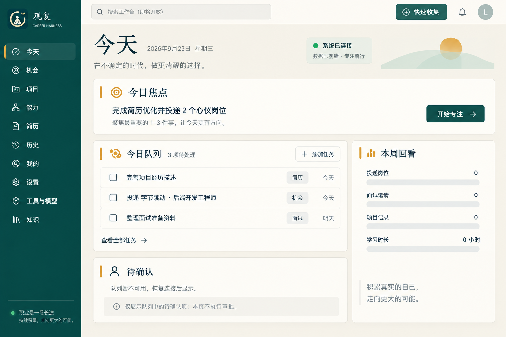

# 观复 · Agent Career Harness



求职资料常散落在岗位网页、项目文件、简历和沟通记录里，改过什么、依据是什么、下一步是否确认，往往很难追溯。观复把求职机会、项目证据、能力、简历版本和沟通草稿放进一个本地优先的桌面工作台，让每次重要修改都有来源、版本和人工确认记录。

## 核心能力

- **岗位机会：** 搜索和浏览职位名称、公司、地点、来源与技能标签；由你决定是否加入求职流程。
- **官方校招来源：** 只读接入腾讯 `join.qq.com` 的公开岗位列表与完整 JD；美图 `campus.meitu.com` / `hr.meitu.com` 的校园/实习列表与公开详情页均已验证。
- **JD 逐条审核：** 在岗位来源面板查看原文快照，逐条接受、拒绝或修改候选要求；接受时绑定已确认能力节点，保留证据和不可变修订历史。
- **项目与证据：** 将项目材料、经历和能力线索关联起来；岗位要求不会被当作个人经历事实。
- **简历审核：** 导入 TXT、Markdown 或 PDF 后先预览；逐条接受、拒绝或手动编辑建议，再生成独立简历版本，不覆盖基础简历。
- **AI 工作台：** 结合当前岗位、简历、申请和已确认记忆整理建议与沟通草稿；内容先进入待确认队列。
- **求职沟通邮箱：** 手动测试连接、读取指定文件夹并关联邮件摘要；审核后的单封草稿可交给系统邮件客户端处理。
- **历史与知识：** 追踪岗位、证据、Patch、简历版本和申请之间的稳定 ID。

## 离线 Demo 与职位数据

Windows Beta 内置 `legacy-jobs-v2` 职位种子，共 **492 条规范化岗位记录**。全部记录包含职位名称、公司、地点、岗位链接、来源类别和技能标签；其中 385 条有采集时间，263 条有发布日期。当前种子没有可验证的岗位摘要、结构化要求、薪资或工作方式值，因此它是历史岗位元数据，不是实时职位订阅或完整 JD 库；缺失信息不会补造。

种子来自经只读迁移和隐私筛查的历史岗位资料。据项目维护者确认，来源台账中的记录均有再分发许可、授权或所有权依据。发布包只包含规范化岗位元数据，不含截图、网页快照、抓取原文、个人资料或运行数据库。Demo Mode 浏览这些岗位不需要 API Key 或外网连接。

## Windows 构建状态

仓库已有 Windows 预发布版 [`v0.1.0-beta.4`](https://github.com/lsh33lxm/career_agent_harness/releases/tag/v0.1.0-beta.4)，其中包含安装包、数据 manifest 和 SHA-256 校验文件。它对应此前已验证的发布快照；当前源码分支的后续修改尚未生成新的安装包，因此不要把 Beta.4 当作当前源码的构建产物。

当前源码 `c77ac63` 已重建并安装 NSIS 包。全新安装窗口完成官方来源状态面板点击、Resume Review 接受/拒绝/手动编辑后接受、生成 ResumeRevision、3 张 `1860x1200` 截图、原生关闭和 Playwright teardown；安装退出码为 `0`，sidecar 残留为 `0`。同一安装包在隔离 `ACH_DATA_DIR` 下验证了 `/health=200`、离线种子查询 `492` 条、占用 `49123` 端口后自动切换到新端口，以及关闭后重启仍可读取 `492` 条。当前 **Desktop Verification Gate v0.1：GO（本次源码与验证范围）**。这不启用自动投递、自动发信或后台批量外部操作。

申请页提供按 Career Core 状态分列的申请看板、面试安排/改期/完成/取消和 RFC 5545 `.ics` 日历导出。导出的事件使用稳定面试 ID、UTC 时间和申请关联字段，便于导入本地日历。

岗位来源适配器只访问官方公开页面或接口，限制域名、分页、响应大小和请求次数；不会读取 Cookie、绕过验证码、提交表单或自动申请。来源现场验证结果和未知字段状态以代码与数据 manifest 为准。

本地浏览和记录不会自动投递岗位、自动发送邮件或执行后台批量外部操作。简历修改、申请状态和每封沟通草稿都由你审核和确认。

已发布 Windows 预发布版：[`v0.1.0-beta.4`](https://github.com/lsh33lxm/career_agent_harness/releases/tag/v0.1.0-beta.4)。安装包 SHA-256：`5c40a3bf730a9fcf508cef02462a4d351d3324bc305dd8e817ac3780b042201f`。这是预发布版本，请先在隔离环境试用。

## 隐私、数据与验收状态

- 默认数据保存在本机；Demo 浏览不连接外部模型或平台。连接外部模型或邮箱需要你主动配置并触发。
- 职位种子只发布已筛查的规范化元数据。职位来源证据不等于个人经历或技能证据。
- **当前 Desktop Verification Gate v0.1：GO（本次源码与验证范围）**。本次安装证据保存在本地 `artifacts/verification/installed-runtime-c77ac63/`，不进入 GitHub 快照；稳定版仍需单独的稳定性决策。安装包 SHA-256：`56207c89e3600e79660430d34b666642ce5302827fed0ec8b8d8ea2d89c4d3fd`；sidecar SHA-256：`e5ac4368c2061160853d306ad05f34f6f5a1652c8e2920ff8a10a99b9f68177a`。

## 本地开发

桌面端使用 Tauri 2、React、TypeScript 和本地 Python API。以下命令安装依赖、运行前端测试并构建生产前端：

```powershell
python -m venv .venv
.venv\Scripts\python.exe -m pip install -r requirements.lock
.venv\Scripts\python.exe -m pip install --no-deps -e .
npm ci
npm test
npm run build
```

源码浏览器子门验证：

```powershell
pwsh -File scripts/verify_desktop_gate.ps1
```

该脚本验证源码生产预览和 API 恢复路径；安装窗口验收仍需在独立临时 `ACH_DATA_DIR` 中执行，并保留本地截图和正常退出证据。
