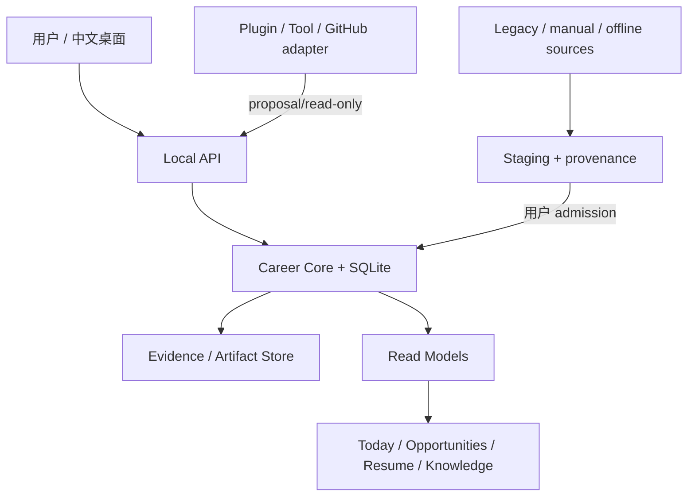

# Agent Career Harness v2.2

日期：2026-09-22  
基线：integration branch `refactor/v1.4-integration`，最终提交将包含本 PRD；当前代码 checkpoint `33165bd`

## 1. 当前结论

Agent Career Harness 当前是一个本地优先、证据约束、人工审核的中文求职工作台。它已经能读取历史岗位、进入 Opportunity、生成简历提案并渲染 ATS/PDF；外部采集、模型调用、消息发送和真实投递仍受权限与凭据约束。

## 2. 已实现

- Career Core：Opportunity、Application、Interview、Outcome、Resume、Evidence、Capability、Audit 与 immutable revisions。
- Legacy：只读导入与 historical projection；真实导入 7,575 条，岗位 staging 1,028，历史投影 6,547，重复 684，失败 0。
- Opportunity Radar：manual/offline source、原文 Artifact、SHA-256、fingerprint 去重、评分、gap、source policy 和用户 admission。
- 离线闭环：`backend/career_harness/services/offline_career_loop_service.py` 串联 fixture 岗位、用户 admission、Resume TargetProfile、EvidenceRef-backed patch proposal、PDF/ATS 和 Application `PREPARING`。
- 沟通草稿：`0031_communication_drafts`、`core/communication.py`、`db/communication_repository.py`、`api/communication.py` 与 Opportunities 页面入口。支持待确认/批准/拒绝等状态，但不发送外部消息。
- Resume Studio：自有 HTML/CSS 与受控 Typst renderer contract、patch review、immutable revision、PDF、ATS、render review、JSON/Markdown export。
- Interview read model：`/api/v1/applications/{id}/interviews` 与 `/api/v1/interviews/{id}`。
- Knowledge/Wiki/Memory：本地检索、来源引用、Wiki revision/proposal、Memory proposal/review/tombstone。
- Plugins/Tools：manifest、权限、scope、schema、运行审计、quarantine、生命周期与 read-only tool registry。
- GitHub：受控只读 clone 和静态项目分析；真实公网验收受当前网络限制。
- Desktop：Tauri + Python sidecar、中文观复主题、Windows NSIS 构建已验收。

## 3. 当前架构与 Truth Map

Career Core 是已确认职业事实、Opportunity、Application、Interview、Outcome 和 Resume 的 canonical truth。Artifact Store 是原始证据的不可变存储。Web/Desktop/Feishu 是 projection。LLM、插件、外部仓库和 Legacy 只能提供 evidence、signal、draft 或 proposal。

## 4. G1–G5 状态

| 阶段 | 状态 | 事实依据 |
| --- | --- | --- |
| G0 参考审计 | 已完成 | 十个本地目录已检查 README、LICENSE/声明、目录；ApplyPilot AGPL，BossHunter/Seeking Stars/Magic Resume 有非商用或额外限制，CapyMock 根目录无 LICENSE；均未复制源码 |
| G1 离线闭环 | 部分完成 | 岗位→Artifact→评分→admission→简历 proposal→PDF/ATS→Application PREPARING 已通过；公司研究、STAR、Outcome/Wiki/Memory 编排未串联 |
| G2 职位与沟通 | 部分完成 | staging/ranking/source policy 与桌面 proposal 草稿入口已实现；每日上限、回复监控未完成 |
| G3 Resume Studio | 部分完成 | render/ATS/patch/review/export 已实现；PDF/图片导入、完整 ResumeData、undo/redo、版本历史 UI 未完成 |
| G4 面试与成长 | 部分完成 | Interview Core 和只读读模型已实现；文本面试、STAR、结构化反馈、学习计划、跨会话会话流未完成 |
| G5 知识与工具治理 | 部分完成 | Knowledge/Wiki/Memory proposal、Task Queue、Tool Registry、SourceConnector 已存在；dispatcher、scheduled sync、memory affinity/consolidation、认证 MCP、CLI sandbox 未完成 |

## 5. 参考仓库采用方式

本轮仅使用 `reference-repos/` 的本地快照做行为和边界参考，没有复制第三方源码、主题、模板或依赖。目录快照没有可用 Git 历史，因此不伪造 commit SHA；来源为对应上游仓库默认分支的本地快照，下载日期以文件系统为准。

| 来源 | 采用方式 |
| --- | --- |
| ApplyPilot | AGPL；仅行为参考：pipeline、评分、事实保护 |
| JobHuntBot | MIT；行为参考：onboarding、never-guess、人工确认 |
| BossHunter | PolyForm Noncommercial；仅行为参考：中文采集、限流、草稿 |
| ai-job-search | MIT；行为参考：rank、ATS、interview-prep |
| career-ops | MIT；行为参考：本地优先、fingerprint、评估 |
| CapyMock | 本地未发现 LICENSE；仅行为参考：面试和项目分析 |
| seeking-stars | MIT Non-Commercial；仅 README/行为参考 |
| CareerDesk | MIT；行为参考：proposal/approve/reject/undo |
| magic-resume | Apache 标识与商业限制并存；不复制代码、模板、字体，仅参考 ResumeData/导出 |
| WeKnora | MIT，含 THIRD_PARTY_NOTICES/licenses；仅 read-only adapter、检索和治理行为参考 |

## 6. 真实验证

- 后端全量：`682 passed, 5 skipped`。跳过项是 Windows symlink 权限限制。
- Resume/Opportunity/Communication/Interview focused tests：通过；最近沟通 migration 回归 `49 passed`，Interview/Career read `8 passed`，Resume Studio API `1 passed`。
- Ruff：`backend tests migrations` 通过。
- `git diff --check`：通过。
- 前端：现有 23 个测试文件、64 项测试；Vite production build 已通过。
- Legacy 源文件未修改；未执行真实 ATS、消息、Feishu、Gmail、Notion 或投递写入。

## 7. 阻塞与限制

- 真实模型连接需要用户凭据；当前仅保存安全配置和未验证状态。
- GitHub 公网 443 在当前环境不可达；合成/离线分析已验证，真实公网验收未伪造。
- Feishu/Gmail/Notion/ATS 外部写入按策略禁止，保持 proposal/dry-run。
- Legacy canonical authority/cutover 需要用户决策。
- 后台常驻 dispatcher、scheduled sync、每模型并发、认证 MCP transport 和 CLI sandbox 尚未实现。
- Memory consolidation/document affinity、GraphRAG、真实 dense embedding/rerank、OCR/VLM/ASR 尚未实现。

## 8. 下一阶段顺序

1. 把 communication draft 接入 Opportunities/Today 桌面页面，加入每日限额和回复事件的离线读模型。
2. 将离线闭环继续编排到公司研究、Interview prep、Outcome 与 proposal-only Memory/Wiki。
3. 补 ResumeData schema、导入校验、revision history、undo/redo 和 PDF/图片离线导入。
4. 增加文本面试会话事件、STAR feedback、学习计划和 GitHub/JD 引用。
5. 实现本地 dispatcher 与任务恢复；再评估认证 MCP 和 CLI sandbox，所有写工具继续 approval-gated。

## 9. v2.2 Definition of Done

G1–G5 的“部分完成”项全部变为有真实 UI、Core/Proposal/Audit 边界、离线 fixture、失败恢复路径和对应回归证据；G6 需重新运行后端/前端/lint/build/E2E，更新本 PRD 的真实计数，并保持 Legacy 只读与外部写入禁止。
