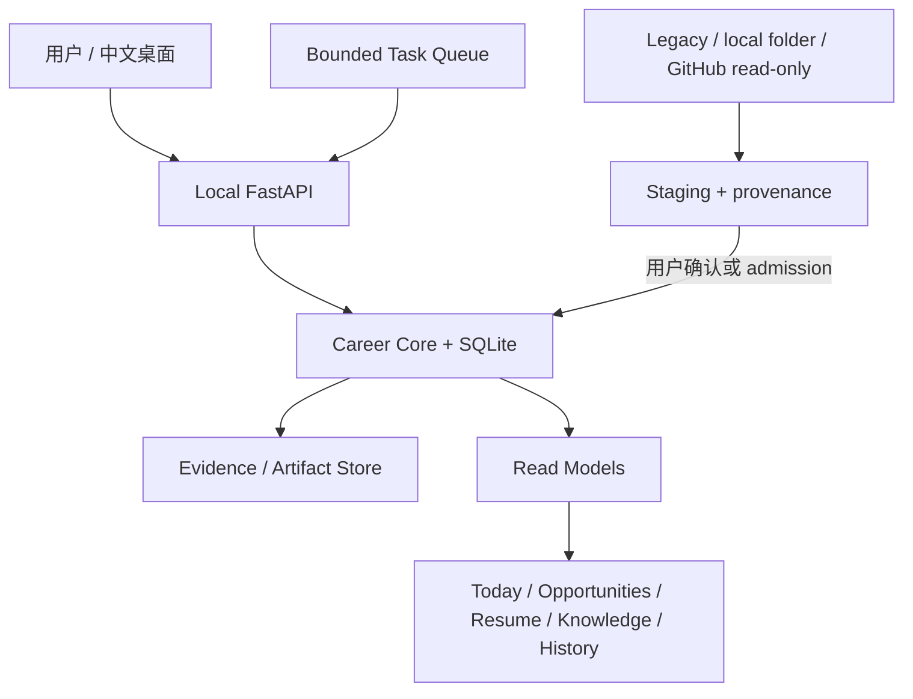

# Agent Career Harness v2.3

日期：2026-09-22  
基线：`refactor/v1.4-integration`，HEAD 以 Git 当前状态为准。

## 0. 当前定位

Agent Career Harness 是本地优先、证据约束、人工审核的中文求职工作台。Career Core 保存用户确认的职业事实、职位、申请、面试、结果和简历；外部资料、模型、插件和 Legacy 只提供证据、信号、草稿或 proposal。

## 1. 已实现能力

- Career Core：Opportunity、Application、Interview、Outcome、Resume、Evidence、Capability、Audit 与不可变 revision。
- Legacy Agent Radar：只读 inventory、hash、结构化导入、历史投影和 provenance；最近真实导入读取 7,575 条，岗位 staging 1,028，历史投影 6,547，重复 684，失败 0。
- 离线求职闭环：岗位原文 Artifact → 评分与 gap → 用户 admission → Resume TargetProfile → EvidenceRef 简历 patch proposal → 观复 PDF/ATS → Application `PREPARING`。
- Opportunity 与沟通：岗位筛选、去重、评分、沟通草稿 proposal、批准/拒绝和摘要读模型；不会自动发送。
- Resume Studio：ResumeData 校验、base/revision/patch review、观复 HTML/CSS、受控 Typst contract、PDF、ATS、JSON/Markdown 导出。`/api/v1/resume/import-text` 与 `/api/v1/resume/import-file` 产生待确认草稿；`/api/v1/resume/bases` 保存确认后的 ResumeBase；`/api/v1/resume/restore` 从不可变历史修订创建新的用户恢复点；`/api/v1/resume/base-restore` 将旧基础版本追加恢复为新的用户版本；`/api/v1/resumes/{resume_id}/bases` 读取全部基础版本；`/api/v1/resume/diff/{revision_id}` 按需提供修订差异及来源引用。PDF 使用无依赖文本 fallback，图片 OCR 明确返回未配置。
- Interview：只读面试查询、技术/行为准备 proposal、已完成面试的回答复盘 proposal，以及 `learning-plan-proposals` 独立学习计划 proposal；复盘 proposal 增加透明的 0–4 规则结构信号和缺失维度学习建议；`0032_interview_session_events` 持久化用户/助手文本事件并校验 EvidenceRef；回答和学习计划不会直接写入 Career Core。
- Knowledge/Wiki/Memory：本地检索、引用、Wiki revision/proposal、Memory proposal/review/tombstone。
- Task Queue：有界 `POST /api/v1/tasks/stages/{stage}/run?max_batches=N` 调度；不启动常驻后台或 shell。SourceConnector 支持 5 分钟至 7 天的 schedule metadata、到期查询和显式有界运行。
- Task dispatcher：`POST /api/v1/tasks/dispatch` 可按指定 stage 顺序执行，并有批次和总任务数上限；不启动常驻进程，沿用已有失败重试与版本保护。
- Communication：草稿批准后可由用户记录已发送、已回复、待跟进、已结束或已阻塞状态；状态更新不触发外部写入。
- Memory：支持按来源 EvidenceRef 查询已确认记忆，并从同一作用域的已确认记忆生成 consolidation proposal；不会自动合并、删除或授予权限。
- Plugins/Tools：manifest、权限、scope、schema、审计、quarantine 与只读 registry；`adapters/mcp_transport.py` 提供认证后的本地 MCP transport boundary，不启动网络或进程，实际 stdio/SSE 接入仍待完成。
- CLI runner：`adapters/cli_runner.py` 提供 approval-gated sandbox boundary；没有注入 sandbox executor 时明确 blocked，应用本身不启动任意 shell。
- GitHub：受控只读 clone 与静态项目分析；当前网络限制下未伪造公网验收。
- Desktop：Tauri + Python sidecar、中文观复主题、Windows NSIS 构建与离线数据目录。

## 2. 真实架构与 Truth Map

Career Core 是 canonical truth；Artifact Store 保存不可变原始证据；Web/Desktop 是 projection；Legacy 是历史来源；模型、插件和工具只能生成 proposal、score、summary 或 suggestion。

## 3. G1–G5 状态

| 目标 | 状态 | 当前边界 |
| --- | --- | --- |
| G1 离线求职闭环 | 部分完成 | 主链路与 proposal/audit 已通过；公司研究、STAR、Outcome/Wiki/Memory 全编排仍未闭环 |
| G2 职位与沟通 | 部分完成 | 排名、来源 policy、草稿和摘要已实现；平台采集、每日限流、回复监控未完成 |
| G3 Resume Studio | 部分完成 | 校验、导出、渲染、ATS、文本/PDF fallback 导入、用户恢复点、基础版本历史查看、追加式旧版本恢复和按需差异 UI 已实现；图片 OCR、字段级 undo/redo 未完成 |
| G4 面试与成长 | 部分完成 | Interview Core、准备/复盘 proposal、持久化文本会话事件、基于规则信号的 STAR 结构评分和独立学习计划 proposal 已实现；用户确认后的学习任务编排、自动 STAR 内容评分、跨会话记忆 consolidation 未完成 |
| G5 知识与工具治理 | 部分完成 | Knowledge/Wiki/Memory proposal、memory affinity/consolidation、SourceConnector、Task Queue、bounded multi-stage dispatcher、Tool Registry、approval-gated CLI runner、认证 MCP transport boundary、显式 scheduled sync metadata 已实现；实际 stdio/SSE 接入、完整 sandbox policy enforcement 和常驻调度仍未完成 |

## 4. 本轮代码切片

- `backend/career_harness/services/task_service.py`：有界多批次 `drain_ready`，限制 1–100 批次。
- `backend/career_harness/api/tasks.py`：暴露显式批次参数的 stage runner。
- `backend/career_harness/services/interview_prep_service.py`、`api/interview_prep.py`：完成面试复盘 proposal，要求已完成面试和 exact EvidenceRef。
- `apps/desktop/src/pages/HistoryPage.tsx`、`api/history.ts`：历史页回答输入与复盘草稿入口。
- `backend/career_harness/api/resume_studio.py`、`services/resume_service.py`：文本/Markdown/PDF fallback 导入校验、用户确认后的 ResumeBase 保存与历史修订恢复入口。
- `backend/career_harness/core/interview/session.py`、`db/interview_session_repository.py`、migration `0032`：持久化文本面试会话事件。
- `backend/career_harness/db/source_connector_repository.py`、`api/source_connectors.py`：受约束 schedule metadata、到期查询与显式有界运行。
- `backend/career_harness/db/communication_repository.py`、`api/communication.py`：人工记录沟通状态转换。
- `backend/career_harness/db/memory_repository.py`、`api/memory.py`：来源亲和度查询与 review-gated consolidation proposal。
- `backend/career_harness/services/task_service.py`、`api/tasks.py`：有界多阶段 dispatcher，支持总任务数限制。
- `backend/career_harness/adapters/cli_runner.py`：仅允许注入 sandbox executor 且需要 approval 的 CLI runner 边界。

## 5. 上游参考仓库采用方式

本轮只读审阅主仓库 `reference-repos/<name>/<name>/` 下的十个本地快照，不复制源码、主题、模板或依赖。快照均无 `.git`；当前工作树也没有 `_archives` ZIP 文件，因此无法提供 ZIP SHA-256，按“本地未版本化快照”记录，不伪造 commit 或 ZIP 哈希。`CapyMock` 没有根目录 LICENSE，`WeKnora` 带 `THIRD_PARTY_NOTICES.md`；参考目录未被修改或提交。

| 仓库 | 采用方式 |
| --- | --- |
| ApplyPilot | AGPL；行为参考 pipeline、评分和事实保护 |
| JobHuntBot | MIT；行为参考 onboarding、never-guess、人工确认 |
| BossHunter | PolyForm Noncommercial；仅参考中文采集、限流和草稿 |
| ai-job-search | MIT；行为参考 rank、ATS、面试准备 |
| career-ops | MIT；行为参考本地优先、fingerprint、评估 |
| CapyMock | 本地未发现 LICENSE；仅行为参考面试和项目分析 |
| seeking-stars | MIT Non-Commercial；仅 README/行为参考 |
| CareerDesk | MIT；行为参考 proposal/approve/reject/undo |
| magic-resume | Apache 标识与商业限制并存；仅参考 ResumeData/导出结构 |
| WeKnora | MIT，含第三方许可；仅参考只读 adapter、检索和治理边界 |

## 6. 质量与安全

- 后端全量：`701 passed, 5 skipped`；跳过项是 Windows symlink 权限限制。
- 前端：23 个测试文件、66 项测试通过；`npm run build` 通过。
- Ruff：`ruff check backend tests` 通过；`git diff --check` 通过。
- 未执行真实 ATS 提交、消息发送、Feishu/Gmail/Notion 写入或 canonical cutover。
- API key 仍由现有安全存储边界管理；本轮没有新增凭据或外部写入。

## 7. 下一阶段顺序

1. 将规则化 STAR 缺失维度建议编排为用户可审核的学习任务 proposal，并补充自动评分的更多可解释信号。
2. 补齐 Resume PDF/图片导入校验、revision history 与可逆 undo/redo UI。
3. 将 SourceConnector 的显式 schedule metadata 接入可恢复后台 dispatcher；保持失败不误删本地知识。
4. 实现认证 MCP/CLI 的只读 sandbox、scope、principal、schema 和审计；真实写工具继续 approval-gated。
5. 完成 G1–G5 离线 E2E 与主题回归后，再更新下一版本 PRD。

## 8. 当前阻塞

- Feishu、Gmail、Notion 和真实申请/消息发送需要凭据、目的地权限和用户授权，保持 `BLOCKED_EXTERNAL_ACTION`。
- Legacy authority 到 canonical Job/Fact/Capability 的 cutover 需要用户确认，当前只保留历史 evidence 与 staging。
- 公网 GitHub/ATS 验收受当前网络环境限制，未伪造成功结果。
