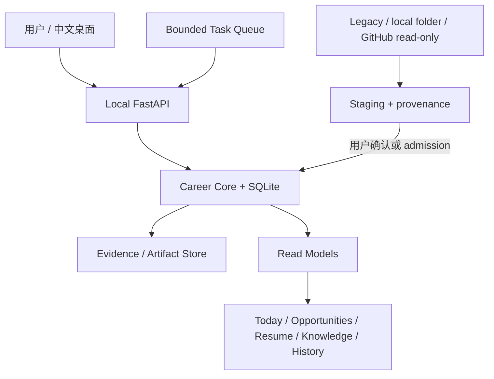

# Agent Career Harness v2.4

日期：2026-09-23；基线：`refactor/v1.4-integration`；Git HEAD 以 `git rev-parse HEAD` 为准。

## 0. 当前定位

Agent Career Harness 是本地优先、证据约束、人工审核的中文求职工作台。Career Core 保存用户确认的职业事实、职位、申请、面试、结果和简历；外部资料、模型、插件和 Legacy 只提供证据、信号、草稿或 proposal。

## 1. 已实现能力

- Career Core：Opportunity、Application、Interview、Outcome、Resume、Evidence、Capability、Audit 与不可变 revision。
- Legacy Agent Radar：只读 inventory、hash、结构化导入、历史投影和 provenance；最近真实导入读取 7,575 条，岗位 staging 1,028，历史投影 6,547，重复 684，失败 0。
- 离线求职闭环：岗位原文 Artifact → 评分与 gap → 用户 admission → Resume TargetProfile → EvidenceRef 简历 patch proposal → 观复 PDF/ATS → Application `PREPARING`。
- Opportunity 与沟通：岗位筛选、去重、评分、沟通草稿 proposal、批准/拒绝和摘要读模型；不会自动发送。
- Resume Studio：ResumeData 校验、base/revision/patch review、观复 HTML/CSS、受控 Typst contract、PDF、ATS、JSON/Markdown 导出。`/api/v1/resume/import-text` 与 `/api/v1/resume/import-file` 产生待确认草稿；`/api/v1/resume/bases` 保存确认后的 ResumeBase；`/api/v1/resume/restore` 从不可变历史修订创建新的用户恢复点；`/api/v1/resume/base-restore` 将旧基础版本追加恢复为新的用户版本；`/api/v1/resume/undo` 从当前基础版本追加恢复到上一版；`/api/v1/resume/redo` 从用户选择的历史版本追加恢复；`/api/v1/resumes/{resume_id}/bases` 读取全部基础版本；`/api/v1/resume/diff/{revision_id}` 按需提供修订差异及来源引用；`ResumeStudioApi.ocr` 提供可注入 OCR adapter，当前运行时未配置。PDF 使用无依赖文本 fallback，图片 OCR 明确降级为待配置。
- Interview：只读面试查询、技术/行为准备 proposal、已完成面试的回答复盘 proposal，以及 `learning-plan-proposals` 独立学习计划 proposal；批准后的学习计划可通过 `/api/v1/interviews/learning-plan-proposals/{proposal_id}/tasks` 进入有界 `interview.learning_plan` 队列；复盘 proposal 增加透明的 0–4 规则结构信号、0–2 内容具体性信号和缺失维度学习建议；`0032_interview_session_events` 持久化用户/助手文本事件并校验 EvidenceRef；回答和学习计划不会直接写入 Career Core。结果洞察 API 可生成 Offer 准备清单与拒信模式分析 proposal，缺失原因保持未知。
- Knowledge/Wiki/Memory：本地检索、引用、Wiki revision/proposal、Wiki health 检查与 review-gated 修复建议 proposal、Memory proposal/review/tombstone。
- Task Queue：有界 `POST /api/v1/tasks/stages/{stage}/run?max_batches=N` 调度，并提供 `TaskService.enqueue_tick` 单次有界 scheduler tick；不启动常驻后台或 shell。SourceConnector 支持 5 分钟至 7 天的 schedule metadata、到期查询和显式有界运行。
- Task dispatcher：`POST /api/v1/tasks/dispatch` 可按指定 stage 顺序执行，并有批次和总任务数上限；不启动常驻进程，沿用已有失败重试与版本保护。
- Communication：草稿批准后可由用户记录已发送、已回复、待跟进、已结束或已阻塞状态；状态更新不触发外部写入。
- Memory：支持按来源 EvidenceRef 查询已确认记忆，并从同一作用域的已确认记忆生成 consolidation proposal；批准后的 task/consolidation memory proposal 可进入有界 `memory.consolidation` 队列；不会自动合并、删除或授予权限。
- Plugins/Tools：manifest、权限、scope、schema、审计、quarantine 与只读 registry；`adapters/mcp_transport.py` 提供认证后的 MCP transport boundary、JSON-RPC stdio 适配器和有界 SSE 事件适配器；`adapters/cli_runner.py` 通过命令白名单和危险参数拒绝强化后端 sandbox policy，不启动网络或进程；真实网络监听、生产认证和宿主级隔离仍待完成。
- CLI runner：`adapters/cli_runner.py` 提供 approval-gated sandbox boundary；没有注入 sandbox executor 时明确 blocked，应用本身不启动任意 shell。
- GitHub：受控只读 clone 与静态项目分析；当前网络限制下未伪造公网验收。
- Desktop：Tauri + Python sidecar、中文观复主题、Windows NSIS 构建与离线数据目录。

## 2. 真实架构与 Truth Map

Career Core 是 canonical truth；Artifact Store 保存不可变原始证据；Web/Desktop 是 projection；Legacy 是历史来源；模型、插件和工具只能生成 proposal、score、summary 或 suggestion。

## 3. G1–G5 状态

| 目标 | 状态 | 当前边界 |
| --- | --- | --- |
| G1 离线求职闭环 | 部分完成 | 主链路、公司研究/STAR/结果归档/Wiki/Memory proposal 与确定性重放已通过；用户批准、提交后 Outcome 证据仍需真实用户流程 |
| G2 职位与沟通 | 部分完成 | 排名、来源 policy、草稿、每日限流、按渠道统计和回复/跟进摘要已实现；平台采集与真实发送仍未完成 |
| G3 Resume Studio | 部分完成 | 校验、导出、渲染、ATS、文本/PDF fallback 导入、用户恢复点、基础版本历史查看、追加式旧版本恢复、服务端 undo/redo、按需差异 UI 和本地草稿撤销/重做已实现；图片 OCR 仍未配置 |
| G4 面试与成长 | 部分完成 | Interview Core、准备/复盘 proposal、持久化文本会话事件、基于规则信号的 STAR 结构与内容具体性评分、独立学习计划 proposal、批准后有界任务入队、Memory consolidation 任务入队，以及历史页可触发的 Offer 准备和拒信模式分析 proposal 已实现；更丰富的模型化评分和跨会话编排未完成 |
| G5 知识与工具治理 | 部分完成 | Knowledge/Wiki/Memory proposal、Wiki health 检查与知识页修复建议 proposal、memory affinity/consolidation、SourceConnector、Task Queue、bounded multi-stage dispatcher、单次 scheduler enqueue tick、Tool Registry、approval-gated CLI runner、CLI 命令白名单/危险参数拒绝/资源上限、认证 MCP transport boundary、JSON-RPC stdio 适配器（输入消息上限）、有界 SSE 事件适配器、显式 scheduled sync metadata 已实现；真实网络监听/生产认证接入、宿主级 sandbox 隔离和常驻调度仍未完成 |

## 4. 本轮代码切片

- `backend/career_harness/services/task_service.py`：有界多批次 `drain_ready`，限制 1–100 批次。
- `backend/career_harness/api/tasks.py`：暴露显式批次参数的 stage runner。
- `backend/career_harness/services/interview_prep_service.py`、`api/interview_prep.py`：完成面试复盘 proposal，要求已完成面试和 exact EvidenceRef。
- `apps/desktop/src/pages/HistoryPage.tsx`、`api/history.ts`：历史页回答输入与复盘草稿入口。
- `backend/career_harness/api/resume_studio.py`、`services/resume_service.py`：文本/Markdown/PDF fallback 导入校验、用户确认后的 ResumeBase 保存与历史修订恢复入口。
- `backend/career_harness/core/interview/session.py`、`db/interview_session_repository.py`、migration `0032`：持久化文本面试会话事件。
- `backend/career_harness/db/source_connector_repository.py`、`api/source_connectors.py`：受约束 schedule metadata、到期查询与显式有界运行。
- `backend/career_harness/db/communication_repository.py`、`api/communication.py`：人工记录沟通状态转换。
- `backend/career_harness/db/memory_repository.py`、`api/memory.py`：来源亲和度查询与 review-gated consolidation proposal。
- `backend/career_harness/services/task_service.py`、`api/tasks.py`：有界多阶段 dispatcher，支持总任务数限制。
- `backend/career_harness/adapters/cli_runner.py`：仅允许注入 sandbox executor 且需要 approval 的 CLI runner 边界。
- `backend/career_harness/services/offline_career_loop_service.py`：同一岗位、简历和查询输入支持确定性重放；研究、STAR、历史、Wiki 与 Memory proposal 使用稳定 ID，重复运行不会产生重复 proposal。

## 5. 上游参考仓库采用方式

当前 integration 工作树不存在 `reference-repos/`，因此本轮不能声称已读取十个本地快照的 README、LICENSE、目录或关键实现；也没有伪造 commit、ZIP SHA-256 或许可证结论。待快照挂载后再进行只读审阅；在此之前只沿用仓库内已有行为契约进行等价实现，不复制第三方源码、主题、模板或依赖。

| 仓库 | 采用方式 |
| --- | --- |
| 十个 reference-repos 快照 | 当前不可验证 | 目录缺失；不得据此声称已审阅、复用或确认许可证 |

## 6. 质量与安全

- 后端全量：`715 passed, 5 skipped`；跳过项是 Windows symlink 权限限制；全量回归覆盖本次文档提交前的实现，Git HEAD 以仓库当前状态为准。
- 前端：23 个测试文件、67 项测试通过；`npm run build` 通过，包含本地草稿撤销/重做用例。
- Ruff：`ruff check backend tests migrations` 通过；`git diff --check` 通过。
- 未执行真实 ATS 提交、消息发送、Feishu/Gmail/Notion 写入或 canonical cutover。
- API key 仍由现有安全存储边界管理；本轮没有新增凭据或外部写入。

## 7. 下一阶段顺序

1. 将规则化 STAR 缺失维度建议编排为用户可审核的学习任务 proposal，并补充自动评分的更多可解释信号。
2. 补齐 Resume 图片导入校验与 OCR adapter 实际配置；服务端和本地草稿 undo/redo 已完成。
3. 将 SourceConnector 的显式 schedule metadata 接入可恢复后台 dispatcher；保持失败不误删本地知识。
4. 实现认证 MCP/CLI 的只读 sandbox、scope、principal、schema 和审计；真实写工具继续 approval-gated。
5. 继续补齐 G1–G5 尚未完成的外部边界后，再更新下一版本 PRD；本轮 G6 回归已完成。

## 8. 当前阻塞

- Feishu、Gmail、Notion 和真实申请/消息发送需要凭据、目的地权限和用户授权，保持 `BLOCKED_EXTERNAL_ACTION`。
- Legacy authority 到 canonical Job/Fact/Capability 的 cutover 需要用户确认，当前只保留历史 evidence 与 staging。
- 公网 GitHub/ATS 验收受当前网络环境限制，未伪造成功结果。

## 9. v2.4 本轮增量

- 沟通草稿每日上限达到后保留为 `BLOCKED`，并记录 `blocked_reason=daily_communication_limit`；草稿不会被静默丢弃，也不会触发外部发送。
- 沟通摘要增加 `channel_counts`，机会页显示邮件与平台消息数量，并显示限流阻断原因。
- 机会页将已记录发送、已回复、待跟进、已结束和已阻断状态统一显示为中文。
- 简历服务端撤销：`POST /api/v1/resume/undo` 通过追加式恢复创建新基础版本，不改写历史记录。
- 简历服务端重做：`POST /api/v1/resume/redo` 通过明确的历史版本引用创建新基础版本，不改写历史记录。
- Wiki 健康治理：知识页可调用 `POST /api/v1/wiki/health/proposals` 将健康检查结果固化为待审核提案；不绑定目标页面，也不自动修复、发布或删除内容。
- 结果洞察：历史页可调用 `/api/v1/outcome-insights/applications/{application_id}/offer-preparation` 与 `/api/v1/outcome-insights/rejection-pattern`；两者只读取已记录 Outcome，使用稳定 proposal ID 保证重复执行幂等，生成 Knowledge proposal，不自动修改申请、简历或 Career Core。
- 当前 integration 工作树没有 `reference-repos/`，因此不能声称已经读取十个上游快照、确认其 commit 或许可证；没有复制第三方源码或资产。

## 10. 下一步与硬边界

可继续的本地工作包括 OCR fixture、Resume 字段级恢复、SourceConnector 失败恢复读模型、Wiki lint-fix proposal 和离线面试编排。真实 Feishu/Gmail/Notion 写入、MCP 网络监听、宿主 sandbox、Legacy canonical cutover 与真实 ATS/平台发送仍需凭据、权限或用户 authority，保持阻断状态。

