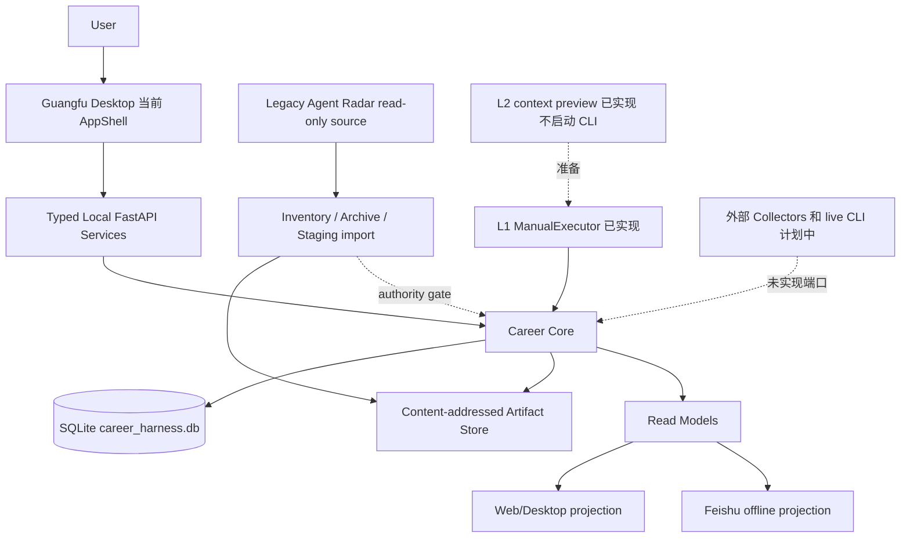

# Agent Career Harness v1.5：现状与下一阶段

日期：2026-09-21。代码观察点：`2e279ba`（Projects/Resume review APPROVE 后合入）。本文只描述 integration 分支已存在、已验证或明确受阻的事实；它不替换 v1.4，也不把计划写成已实现。

状态标记：**已实现**、**部分进行中**、**计划中**、**外部阻塞**。

## 0. Executive Summary

Agent Career Harness 是一个本地优先、证据约束的个人职业工作台：Career Core 保存可审计的职业状态，桌面端和 Feishu 都是可重建投影，执行器只执行用户授权的任务。

## 1. Current Product State

**已实现：** FastAPI 本地 API、SQLite 迁移链 0001–0013、Today 读模型、Opportunities 优先级与 admission、Official/Personal Capability 图、Capability Inbox review、Match/Gap、Project Evidence、Resume/Application/Outcome/Interview 持久化和只读历史投影、Evidence provenance API、Broad Market Trend、离线 Feishu Today preview、L1 offline acceptance、L2 明确上下文准备、观复视觉基线，以及 Legacy 的只读 inventory、archive、reconciliation、dry-run import、backup/restore rehearsal。

**部分进行中：** Projects、Resume 已交付明确 ID 的窄只读客户端，编辑、列表发现与完整流程未完成；真实 legacy Job/Interview/Capability 结构化映射仍处审计/待决阶段，未写入业务表；Today 的快速收集和本周回看仍显示明确 unavailable；L2 runner/result、真实 CLI provider、完整 Feishu sync 尚未实现。

**外部阻塞：** canonical legacy cutover 需要用户决定身份、重复记录和 authority；Feishu 外部写入需要 credentials、destination permission 和独立 sync contract。

## 2. Product Principles

- Local-first：本地 API、SQLite 与 Artifact Store 是默认运行边界。
- Evidence-constrained：Evidence、Fact、Signal、Decision、Outcome 分离；来源不能因出现次数而升级权威。
- Human-in-the-loop：USER 控制身份、法律/工作授权、优先级和最终提交；AI/adapter 不审批自己的建议。
- Stable Core / Pluggable Execution：Core 拥有职业 truth，执行器可替换。
- Replayable / Auditable：revision、exact provenance、DomainEvent、idempotency 和 deterministic read model 支持重放。

## 3. Current Architecture

实际默认目录由 `AppPaths` 决定：Windows 为 `%LOCALAPPDATA%/AgentCareerHarness`，数据库名为 `career_harness.db`，可由 `ACH_DATA_DIR` 覆盖。API 只允许绑定 `127.0.0.1`，启动 token 在非 test 环境必需。

## 4. Current Information Architecture

一级导航已收敛为 Today、Opportunities、Projects、Capabilities、Resume、History、Me/Context、Settings。Discover、Watchlist、Opportunity、Application、Interview 属于 Opportunities domain；当前桌面实际路由为 `/`、`/opportunities`、`/projects`、`/capabilities`、`/capabilities/inbox`、`/resume`、`/history`、`/history/evidence`、`/context`、`/settings`。

## 5. Today

**已实现：** TodayPage 消费 Core `GET /api/v1/today` 的 deterministic queue，展示今日焦点、队列、需要你确认等区域，分别显示 Suggested Priority 与 User Priority，并保留精确 source revisions。面试安排从精确 immutable audit 恢复时区。

**部分进行中：** 快速收集与本周回看是明确 unavailable；没有生产 mock fallback。需要你确认只投影已有 review_request，不是完整 approval inbox；Core 按已冻结 policy 排序，UI 不额外排序。TodayService 没有 canonical deadline 来源，也没有接入 InvestmentState；它不重算 SuggestedPriority，不改变 User Priority。真实用户数据验收仍缺。

## 6. Opportunities

Opportunities API/UI 支持 authenticated admission、watching/qualified/preparing 等状态、独立 Suggested/User Priority 和 retry-safe mutation。Job、JobRequirement、Match/Gap 的 Core persistence 已有 exact refs。Discover、完整 Watchlist 体验、真实 legacy 岗位导入和 ATS 提交仍是部分或计划中。

## 7. Projects / Project Evidence

Project identity、scan scope、immutable source manifest、Project Evidence、Capability State、basis 和 L1 enhancement task 已存在，scanner 做 scope/reparse/secret boundary 检查；L1 只生成可审核计划，不改项目文件。Projects 桌面窄只读查询已交付：明确 ID/可选 revision、证据 metadata、root_locator 隐藏和 provenance fail-loud；UI 不提供整个项目的历史证据快照、枚举或触发扫描；所选 Project 可精确读 revision，返回证据明确是各自最新修订。

## 8. Capability System

Official Capability Graph 是 versioned immutable Core 数据；Personal Capability Overlay、EvidenceBinding、MarketBinding、InvestmentState 分开保存。Capability Workspace Visualization 是只读 candidate-scoped projection，Capability Inbox 的接受动作仍由 USER review service 和 graph release 约束。Visualization 不创建 canonical truth、不认证 mastery、不修改 User Priority。真实 legacy skill/topic 目前仅作为数据基线中的候选线索，未创建 Core 候选节点或 MarketBinding，不能由频次自动生成能力或 investment。

## 9. Resume

Resume Base、Patch Proposal、immutable Resume Revision 和 exact provenance-qualified review path 已实现，HTTP 只读 base/revision endpoint 已实现。Resume 页面已支持显式 Base/Revision 查询；渲染 PDF 和生成交互尚未提供；无人审核 promotion 被明确禁止；不得把 Coding Agent 输出直接当作 Resume Fact。

## 10. Career History / Outcomes

Application、Interview、Outcome revision 与 evidence refs 已持久化；History 页面和 `/history/evidence` 只读展示 exact application revision、authority 和 provenance。Outcome 不由当前阶段推断，也不把 legacy 面经变成个人经历。

## 11. Legacy Agent Radar Migration

Legacy 实际来源为 `D:/0.小红书投稿/小红书稿/9.15 三期/agent_rader`，始终只读。最新 inventory 为 2,426 files、377,785,991 bytes，inventory hash 为 `0958a30658003fd67efdce7722b1870a4c9963744e1a21f1693961b289dc43ce`，前后 source metadata signature 相同，hash failures 和 skipped links 均为 0。2,205 paths 已进入可恢复 Artifact Store subset，204 excluded，17 deferred；archive index 为 `efb43972490aca6a249bf0c74a52ea9bfb5756465d7fa408ea708a611841536c`。rehearsal 1,141 artifacts、2,205 sources/snapshots/refs，logical hash 为 `a3f65bfb4e06ba48b1ff5418d2b602a5d9e89557cf0f4e15a20870f8e7789252`，reimport、fresh rebuild、FK、provenance、backup/restore 均通过。

35 个重复 JD URL、S/C grade 冲突、231 个面经 ID 映射、82 个 question mapping 差异和 270 条未开始刷题记录均保留为未决 staging；没有 LegacyJob/LegacyEvidence 平行 truth，也没有 production DB cutover。17 deferred（16 bytecode、1 credential-like JavaScript）仍依赖 Legacy 原件；已保留子集可独立恢复，不能声称全部历史源可删除。

## 12. Data Baseline

详见 [DATA_BASELINE_v1.0.md](DATA_BASELINE_v1.0.md) 和 [PRD_DELTA_v1.4_to_v1.5.md](PRD_DELTA_v1.4_to_v1.5.md)。真实基线区分观察 coverage、dictionary coverage、父 ID 去重频次、source grade、日期精度和 Excel formula/cache 缺失；Excel 是 historical artifact/projection reference，不是运行时 canonical database。数据支持 evidence/provenance/versioning 的必要性，但不证明市场代表性、推荐收益、个人 mastery 或 Application→Outcome 转化。

## 13. Frontend Design System

观复基线已合入 `babf9c0`：深墨绿、暖纸色、暖白、少量金色，Songti 标题和 Kaiti motto，6/8px radius、6/12/18/24px spacing、轻 shadow、无 glass/neon/gradient。清理后的 `brand-icon-clean.png` 只移除外边界连通黑像素，保留内部图形；sidebar 有 padding、rounded clipping 和可见 focus。Today、Capabilities、Inbox 共用 tokens，响应式检查覆盖 1920、1440、1280、1024、768、390、320px。

## 14. Feishu

Feishu 定位是可重建 projection。`feishu-today-preview-v1` 纯函数导出 deterministic JSON，包含完整 input hash、policy version、exact revisions、ordered rows 和 stable mapping；6 个 focused tests 通过。没有 SDK、credentials、network、Core write 或 inbound mutation。真实外部写入标记为 `BLOCKED_EXTERNAL_ACTION`。

## 15. Coding Executor / Multi-CLI Direction

L1 `ManualExecutor` 已能在 canonical Project/Gap 上生成和推进可审计计划；L2 只做 explicit-context invocation preview，Claude tool-disabled 参数可准备，Codex 对此 capability 明确 unsupported。没有 live provider launch、runner/result contract、L3、通用 multi-agent platform 或 CLI session 作为职业 identity。

未来 Main Workbench 的结构是 Workspace → Goal → Task → Execution Run → Provider Session；这是方向，尚无完整实体链、调度器或通知平台。Harness 拥有 task/contract/policy/boundary/evidence/approval/result，executor 只执行。现有 DomainEvent/outbox 可作为后续事件基础，但 task-centric 通知尚未实现；未来应显示“任务 review 完成”，隐藏 provider session 细节。

## 16. Security / Permissions

localhost-only + bearer launch token；用户控制高影响决定；project scanner 使用 scope/reparse/deny-wins 检查；Artifact Store 校验 size/hash；legacy inventory 不跟随 links；凭据目录、session fixtures 和 raw personal material 不归档到 Git。禁止 `git add .`、强制 push、main merge、破坏性 cutover 和 legacy 写入。

## 17. Current Data Model

当前批准/已实现对象包括 EvidenceArtifact/Source/Snapshot/Ref、Job/JobRevision/JobRequirement、Opportunity/Watchlist/Priorities、Capability Graph/Node/Relation/Candidate/PersonalState/Binding/Investment、Project/ScanScope/Manifest/Entry/Evidence/CapabilityState/Basis/EnhancementTask、ContextManifest、MatchAssessment/Result/Gap、ExtractedClaim/Fact、Resume Base/Patch/Revision、Application/Interview/Outcome，以及 DomainEvent、Idempotency、Outbox、Audit metadata。迁移文件为 0001–0013；不存在 LegacyJob 等长期平行模型。

## 18. Current End-to-End Loops

**已闭环：** disposable Job→Opportunity→Match→Fact→Resume→Application→Outcome→replay vertical proof；Today deterministic read；Capability Inbox user review；Legacy archive/rehearsal/restore。

**部分闭环：** Project scan→evidence→capability/task（L1 plan 不自动执行）；Opportunity→History read；Evidence→History provenance；Feishu offline export。

**尚未闭环：** 真实 legacy authority cutover、真实市场数据到 canonical Job/Capability 的映射、Resume render/application preparation、live CLI execution、Feishu external sync、真实 user Application→Outcome feedback。

## 19. Tests / Quality State

最终 backend（`12315f4`；后续 `2e279ba` 仅改前端提示文案）：**602 passed, 5 skipped**；跳过为 Windows symlink privilege/availability。Ruff `backend tests migrations importers tools/clean_brand_icon.py` 通过，`git diff --check` 通过。前端：**56 passed / 15 files**，`npm run build` 通过。Evidence/archive/Feishu 合集 focused 27 passed；Projects API/repository 12 passed，独立 reviewer 另测 Career API 2 passed；archive rehearsal和data baseline包含独立审查记录。视觉 baseline另有 84 browser combinations passed。

真实 rehearsal metadata 通过只读 HTTP 验收：23 页、2205 refs 和2205 exact detail全部匹配，401/完整性/FK通过，DB前后 SHA不变；见[验收报告](../v1.5/real-data-projection-acceptance.md)。这不是生产职业记录或真实浏览器闭环。

## 20. Known Limitations

Me/Context 与 Settings 仍是占位入口；Projects/Resume 仅为按 ID 查询；部分 backend read models 没有完整客户端；真实数据 mapping 需 authority decision；面试实际日期和 JD 发布时间存在大量缺失；Excel formula cache 不完整；visual browser checks 使用 synthetic interception，未替代 native Tauri/真实生产数据验证。

## 21. External Blockers

`BLOCKED_EXTERNAL_ACTION`：Feishu credentials、destination permission、同步契约和生产写入。`NEEDS USER AUTHORITY`：legacy canonical identity、35 URL 冲突、source grade 语义、82 mapping 版本、candidate identity 与 production cutover/rollback。其余 reversible inventory、archive、staging、dry-run、reports、tests、read projections 不阻塞。

## 22. Technical Debt

Projects/Resume 窄 read clients 已合入，仍需补齐真实 fixture、Context 客户端和更完整的 acceptance；清理历史文档中的旧 test counts 和过时 P0F/P0B 状态；补充真实数据 fixture、native Tauri acceptance、公式业务口径与完整 provenance closure；完成 runner/result contract 后才能继续 L2。

## 23. Next Development Phase

依赖顺序为：先补 Projects/Resume 真实 fixture 与 acceptance；再定义并 review legacy structured mapping contract（不做 authority promotion）；补真实 Core read-model fixtures 和 UI acceptance；随后定义 L2 runner/result contract；最后在用户 authority 和外部 credentials 到位后，分别处理 canonical cutover 与 Feishu sync。

## 24. P0 / P1 / P2 Roadmap

| 优先级 | 当前切片 | 状态 |
| --- | --- | --- |
| P0 | Core invariants、read APIs、visual baseline、legacy preservation/rehearsal、offline projections | 已实现 |
| P1 | Projects/Resume clients、structured legacy staging mapping、真实数据 read-model acceptance、L2 runner/result contract | 部分进行中/计划中 |
| P2 | Feishu external sync、canonical legacy cutover、live CLI/ATS/browser actions、真实 outcome feedback | 外部阻塞或计划中 |

本轮可验收范围：视觉、保存/恢复、数据基线、现有域只读投影、Feishu离线准备和当前态审计已完成。完整产品路线图不是本轮已交付声明；个人配置、周回看、完整履历工作流与live executor属于下一阶段新产品切片，仍需各自契约与验收。

## 25. Definition of Done for v1.5

v1.5 只有在上述真实 read clients、structured mapping review、真实数据 acceptance、L2 contract/review、外部动作授权边界和完整回归都记录后，才能称为产品阶段完成。本文件本身的 DoD 是：每项状态可由代码、迁移、测试或审计文档追溯；所有未完成项明确标记；不存在把计划、synthetic test 或 offline preview 写成生产事实。

## Implementation Matrix

Real Data 列区分接口能读取真实 Core 与已验收真实业务闭环。除 archive/rehearsal 与基线审计外，本轮没有向生产数据库导入用户职业数据；Core-backed UI 不等同已填充真实履历。

| Feature | Contract | Implementation | Tests | UI | Real Data | Status | Next Action |
| --- | --- | --- | --- | --- | --- | --- | --- |
| Career Core | 0.17.0 | migrations 0001–0013、services、repos | 602 passed / 5 skipped | Today/partial | synthetic fixtures；未验收真实履历 | 已实现 | read-client coverage |
| Evidence | provenance contract | Artifact/Source/Ref + API | focused/integration | Evidence/History | archive/rehearsal subset，非 production | 已实现 | closure fixtures |
| Opportunity | priority/admission | API + persistence | integration/UI | Opportunities | 未验收生产数据 | 已实现 | full discover/read |
| Match / Gap | exact resolver | policy + persistence | unit/integration | partial | synthetic Core fixtures | 已实现 | data mapping |
| Today | 0.8–0.14.1 | deterministic service/API | integration/frontend | Today | Core-backed，非真实数据验收 | 已实现 | capture/review data |
| Capability Inbox | 0.16.0/D-026 | review service/API | focused/frontend | Inbox | synthetic candidate | 已实现 | merge-target UX |
| Capability Visualization | 0.13.0/D-023 | workspace assembler/API | 13 focused + browser | Capabilities | Core-backed，非真实数据验收 | 已实现 | richer fixtures |
| Broad Market Trend | 0.12.0/D-022 | on-read aggregation | full regression | 无专用 trend UI；Capabilities 显示 binding counts | synthetic BROAD bindings；legacy 未映射 | 已实现 | canonical data gate |
| Project Scan | project evidence | scope-safe scanner + narrow read API | integration | Projects metadata/evidence | synthetic/Core | 部分进行中 | richer client acceptance |
| Project Enhancement | L1 contract | ManualExecutor/service | acceptance | none | synthetic | 部分进行中 | L2 contract |
| Resume | 0.6.0 | base/patch/revision + reads | integration | Base/Revision read page | Core-backed，非真实数据验收 | 部分进行中 | render + fixture acceptance |
| Interview | 0.11.0/D-021；Today D-024 | revisioned records | integration | Today schedule；无独立面试 UI | Core-backed，非真实数据验收 | 已实现 | appointment UX |
| Legacy Migration | 0.17.0/D-027 | inventory/archive/rehearsal | archive 18 focused；27 为跨模块合集 | no | 2426-file audit | 部分进行中 | authority mapping |
| Frontend Baseline | visual task | tokens/logo/routes | 56/build/84 browser | shared | synthetic visual | 已实现 | native acceptance |
| Feishu | Today 契约 + offline task；ADR-015 仍 PROPOSED | offline preview/schema | 6 focused | none | synthetic TodayQueue | 部分进行中 | credentials + sync contract |
| CLI Executor | L1/L2 prep | ManualExecutor + preview | acceptance/95 focused | none | synthetic | 部分进行中 | runner/result contract |
| Main Workbench | v1.4 direction | AppShell + task primitives | existing UI tests | partial | Core-backed，非真实数据验收 | 计划中 | keep Task-centric boundary |

## Truth Map

| System | Truth role |
| --- | --- |
| Career Core / SQLite | canonical truth for newly approved Harness records |
| Artifact Store | immutable evidence bytes and provenance |
| Desktop/Web | rebuildable projection and user command client |
| Feishu | projection/export; no canonical authority |
| LLM | inference/proposal only |
| CLI Executor | execution and result reporting only |
| Legacy Agent Radar | historical source; always read-only, including after an approved cutover |

## Changes Since PRD v1.4

**Implemented:** visual baseline and cleaned derivative logo；Today/Capability/Inbox shared presentation；Evidence provenance and History projection；fresh legacy inventory、archive/rehearsal、backup/restore；data baseline and PRD delta；offline Feishu projection；Projects/Resume 窄只读客户端 `05913cb` → `12315f4`。

**Changed:** 当前 migration contract 从“准备”推进为可验证的 reversible archive/rehearsal；Career Core 实际迁移链已达到 0013；默认数据库目录与 `AppPaths` 对齐；frontend primary navigation 已收敛。

**Deferred:** legacy canonical authority、structured Job/Interview/Capability promotion、Projects/Resume full workflows、Feishu external writes、L2 runner/result、live CLI/ATS。

**Dropped:** 没有将批准的 v1.4 功能标为删除。以下是明确未采用的路线： LegacyJob/LegacyEvidence 平行模型、Excel runtime truth、generic multi-agent platform 或自动 mastery promotion。

**Clarified:** source grade 不等同 Core authority；project presence 不等同 mastery；coding plan 不等同 personal evidence；Task 是产品概念，Session 是基础设施细节；exact provenance dangling 必须失败。

## Sources and Audit Anchors

- [Shared contracts](../v1.4/contracts.md)、[decision log](../v1.4/decision-log.md)
- [Legacy reconciliation](../migration/LEGACY_RECONCILIATION_REPORT.md)、[cutover gate](../migration/CANONICAL_CUTOVER_GATE.md)
- [Data baseline](DATA_BASELINE_v1.0.md)、[PRD delta](PRD_DELTA_v1.4_to_v1.5.md)
- [Visual baseline](../frontend/VISUAL_BASELINE.md)、[offline Feishu mapping](../frontend/FEISHU_PROJECTION_PREPARATION.md)

### 代码与测试定位

- API wiring：[runtime.py](../../backend/career_harness/api/runtime.py)；路由：[App.tsx](../../apps/desktop/src/app/App.tsx)。
- Schema：[models.py](../../backend/career_harness/db/models.py)、[migrations](../../migrations/versions)；模型类与表的存在不证明 production 数据已填充。
- Today：[today_service.py](../../backend/career_harness/services/today_service.py)、[policy.py](../../backend/career_harness/core/today/policy.py)。
- Project/Resume 查询：[project_reads.py](../../backend/career_harness/api/project_reads.py)、[career_reads.py](../../backend/career_harness/api/career_reads.py)。
- Vertical proof：[test_p0_vertical_slice.py](../../tests/integration/test_p0_vertical_slice.py)；L1：[test_l1_offline_acceptance.py](../../tests/integration/test_l1_offline_acceptance.py)。
- 迁移：[test_legacy_archive_rehearsal.py](../../tests/integration/test_legacy_archive_rehearsal.py)；Evidence：[test_evidence_api.py](../../tests/integration/test_evidence_api.py)。

历史 formatting debt 保留；不执行全库 format。Frontend package 没有独立 lint script，`tsc -b` 随 build 执行，不能把未配置的 frontend lint 写成 passed。原生 Tauri/Rust 本轮未重测。
